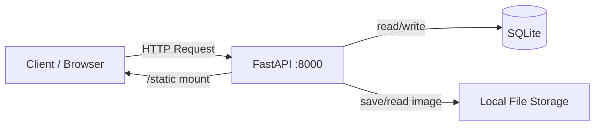
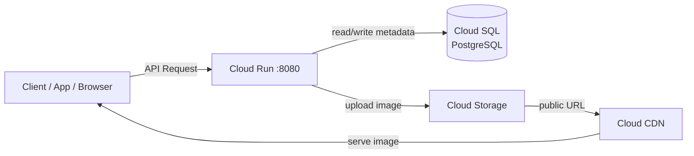

# QR Code Generator

A RESTful API service for creating, managing, and serving dynamic QR codes. Built with FastAPI, designed for local development with SQLite and production deployment on Google Cloud (Cloud Run + Cloud SQL + Cloud Storage + CDN).

## Tech Stack

- **Framework**: FastAPI + Uvicorn
- **ORM**: SQLAlchemy 2.0
- **Validation**: Pydantic v2
- **QR Generation**: qrcode + Pillow
- **Database**: SQLite (local) / Cloud SQL PostgreSQL (production)
- **Storage**: Local filesystem (local) / Google Cloud Storage (production)
- **Deployment**: Docker + Cloud Run

## Architecture

### Local Development



### Production (GCP)



The `ENVIRONMENT` setting (`local` / `production`) switches database, storage backend, and image URL strategy via a factory pattern.

## API Endpoints

| Method | Path | Description | Status |
|--------|------|-------------|--------|
| `POST` | `/v1/qr_code` | Create a new QR code | 201 |
| `GET` | `/v1/qr_code/{token}` | Get QR code metadata | 200 |
| `PUT` | `/v1/qr_code/{token}` | Update target URL | 204 |
| `DELETE` | `/v1/qr_code/{token}` | Soft delete QR code | 204 |
| `GET` | `/v1/qr_code_image/{token}` | Generate/fetch QR image | 200 |
| `GET` | `/{token}` | 302 redirect to target URL | 302 |

### Image Query Parameters

| Param | Default | Range |
|-------|---------|-------|
| `dimension` | 256 | 32–2048 |
| `color` | `#000000` | 6-digit hex |
| `border` | 4 | 0–20 |

## Quick Start

```bash
# Setup
python3 -m venv .venv && source .venv/bin/activate
pip install -r requirements.txt
cp .env.example .env

# Run
uvicorn app.main:app --reload --port 8000

# Try it
curl -X POST http://localhost:8000/v1/qr_code \
  -H "Content-Type: application/json" \
  -d '{"url": "https://example.com"}'
# → {"qr_token": "aBcDeFgHiJ"}

curl "http://localhost:8000/v1/qr_code_image/aBcDeFgHiJ?dimension=256"
# → {"image_location": "http://localhost:8000/static/qr/aBcDeFgHiJ/xxxxx.png"}
```

## Testing

```bash
pytest tests/ -v
```

Uses FastAPI `TestClient` with an isolated test database — no side effects on development data.

## Production Deployment (GCP)

1. **Cloud SQL** — PostgreSQL 15 instance
2. **Cloud Storage** — Bucket for QR images, public read via CDN
3. **Cloud Run** — Stateless container, env vars configured via `--set-env-vars`

```bash
# Build & deploy
gcloud builds submit --tag gcr.io/<PROJECT_ID>/qr-code-generator
gcloud run deploy qr-code-generator \
  --image gcr.io/<PROJECT_ID>/qr-code-generator \
  --region asia-east1 \
  --allow-unauthenticated \
  --add-cloudsql-instances <PROJECT_ID>:asia-east1:qr-db
```

See `.env.prod` for the full list of production environment variables.

## Key Design Decisions

- **Soft delete** — Records are never physically removed; `status` field filters active entries
- **302 redirect** (not 301) — Allows URL updates to take effect immediately
- **Spec hashing** — QR images are cached by `SHA-256(image_spec)`, avoiding regeneration for identical parameters
- **Token generation** — `SHA-256(url + nonce + secret)` → Base62, first 10 chars. Retries on collision.
- **Pluggable storage** — `StorageBackend` ABC with factory pattern; swap backends without touching business logic
