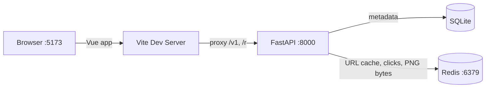
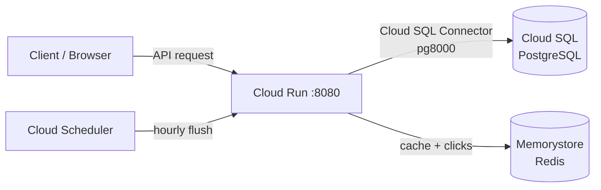

# QR Code Generator

A full-stack QR code management service. Vue 3 frontend + FastAPI backend with dynamic redirect links, click tracking, and customisable QR images. Redis-backed for fast URL cache, async click counters, and PNG byte caching. Local dev runs on SQLite; production runs on Cloud Run + Cloud SQL + Memorystore.

## Tech Stack

**Backend**
- **Framework**: FastAPI + Uvicorn (single process — no `--workers`)
- **ORM**: SQLAlchemy 2.0
- **Migrations**: Alembic
- **Validation**: Pydantic v2
- **QR Generation**: qrcode + Pillow
- **Database**: SQLite (local) / Cloud SQL PostgreSQL via Cloud SQL Python Connector (production)
- **Cache & async work**: Redis — URL cache, hourly click counter, PNG byte cache
- **Deployment**: Docker + Cloud Run

**Frontend**
- **Framework**: Vue 3 + TypeScript
- **Build tool**: Vite

## Architecture

### Local Development



### Production (GCP)



`ENVIRONMENT` and `INSTANCE_CONNECTION_NAME` together select the DB transport. Single `app/database.py` factory branches on these — see [CLAUDE.md](CLAUDE.md) for connection-pool sizing rationale.

## API Endpoints

| Method | Path | Description | Status |
|--------|------|-------------|--------|
| `POST` | `/v1/qr_code` | Create a new QR code (also pre-warms URL cache) | 201 |
| `GET` | `/v1/qr_codes` | List all QR codes | 200 |
| `GET` | `/v1/qr_code/{token}` | Get QR code metadata | 200 / 410 |
| `PUT` | `/v1/qr_code/{token}` | Update target URL (invalidates cache) | 204 |
| `DELETE` | `/v1/qr_code/{token}` | Soft delete (invalidates cache) | 204 |
| `GET` | `/v1/qr_code_image/{token}` | Returns PNG bytes (`image/png`, `Cache-Control: max-age=300`) | 200 / 404 |
| `GET` | `/r/{token}` | 302 redirect to target URL (also fires `HINCRBY` click counter) | 302 / 410 |
| `POST` | `/internal/flush_clicks` | Drain hourly click counter to DB (Cloud Scheduler trigger, `X-Internal-Token` header) | 200 |

`click_count` and `last_clicked_at` are eventually consistent — they lag up to 1 hour behind real traffic, populated by the hourly flush job.

### Image Query Parameters

| Param | Default | Range |
|-------|---------|-------|
| `dimension` | 256 | 32–2048 |
| `color` | `#000000` | 6-digit hex |
| `border` | 4 | 0–20 |

## Quick Start

```bash
# Redis (required for URL cache, click counters, image bytes)
docker run -d -p 6379:6379 --name qr-redis redis:7-alpine

# Backend
python3 -m venv .venv && source .venv/bin/activate
pip install -r requirements.txt
cp .env.example .env
uvicorn app.main:app --reload --port 8000

# Frontend (separate terminal)
cd frontend && npm install && npm run dev
# Open http://localhost:5173
```

SQLite auto-creates the schema on first boot. For PostgreSQL, run `alembic upgrade head` instead.

API smoke:

```bash
curl -X POST http://localhost:8000/v1/qr_code \
  -H "Content-Type: application/json" \
  -d '{"url": "https://example.com"}'
# → {"qr_token": "aBcDeFgHiJ"}

curl -o qr.png "http://localhost:8000/v1/qr_code_image/aBcDeFgHiJ?dimension=256"
# → PNG bytes saved to qr.png

curl -L http://localhost:8000/r/aBcDeFgHiJ
# → 302 → https://example.com
```

## Testing

```bash
pytest tests/ -v
```

Uses FastAPI `TestClient` + isolated SQLite test DB + `fakeredis`. No GCP credentials required.

## Production Deployment (GCP)

Prerequisites: [gcloud CLI](https://cloud.google.com/sdk/docs/install), GCP project with billing enabled.

### 1. Enable APIs

```bash
gcloud projects create <PROJECT_ID>
gcloud config set project <PROJECT_ID>
gcloud services enable \
  run.googleapis.com \
  sqladmin.googleapis.com \
  redis.googleapis.com \
  cloudbuild.googleapis.com \
  artifactregistry.googleapis.com \
  cloudscheduler.googleapis.com \
  secretmanager.googleapis.com \
  vpcaccess.googleapis.com
```

### 2. Create Cloud SQL (PostgreSQL)

```bash
gcloud sql instances create qr-db \
  --database-version=POSTGRES_15 \
  --tier=db-f1-micro \
  --region=asia-east1

gcloud sql databases create qrdb --instance=qr-db
gcloud sql users create qrapp --instance=qr-db --password=<DB_PASSWORD>
```

### 3. Create Memorystore for Redis

```bash
gcloud redis instances create qr-redis \
  --size=1 --region=asia-east1 \
  --redis-version=redis_7_0
# Note the resulting host IP for REDIS_URL below.
```

Memorystore lives inside a VPC, so Cloud Run needs a Serverless VPC Access connector to reach it:

```bash
gcloud compute networks vpc-access connectors create qr-connector \
  --region=asia-east1 --network=default --range=10.8.0.0/28
```

### 4. Apply migrations via Cloud SQL Auth Proxy

```bash
# Run from a dev box / CI — not from Cloud Run
cloud-sql-proxy <PROJECT_ID>:asia-east1:qr-db &
DATABASE_URL="postgresql+psycopg2://qrapp:<DB_PASSWORD>@127.0.0.1:5432/qrdb" \
  alembic upgrade head
```

### 5. Store secrets

```bash
echo -n "<DB_PASSWORD>" | gcloud secrets create qr-db-pass --data-file=-
openssl rand -hex 32 | gcloud secrets create qr-server-secret --data-file=-
openssl rand -hex 32 | gcloud secrets create qr-internal-token --data-file=-
```

### 6. Build & deploy

```bash
gcloud artifacts repositories create qr-repo \
  --repository-format=docker --location=asia-east1

gcloud builds submit \
  --tag asia-east1-docker.pkg.dev/<PROJECT_ID>/qr-repo/qr-code-generator

gcloud run deploy qr-code-generator \
  --image asia-east1-docker.pkg.dev/<PROJECT_ID>/qr-repo/qr-code-generator \
  --region asia-east1 \
  --allow-unauthenticated \
  --max-instances=6 --min-instances=0 \
  --concurrency=80 --cpu=1 --memory=512Mi \
  --vpc-connector=qr-connector \
  --service-account=qr-runtime@<PROJECT_ID>.iam.gserviceaccount.com \
  --set-env-vars="ENVIRONMENT=production,INSTANCE_CONNECTION_NAME=<PROJECT_ID>:asia-east1:qr-db,DB_USER=qrapp,DB_NAME=qrdb,CLOUD_SQL_IP_TYPE=PUBLIC,REDIS_URL=redis://<MEMORYSTORE_IP>:6379/0" \
  --set-secrets="DB_PASS=qr-db-pass:latest,SERVER_SECRET=qr-server-secret:latest,INTERNAL_TOKEN=qr-internal-token:latest"
```

The runtime service account needs `roles/cloudsql.client` and `roles/redis.editor`.

> Don't pass `--add-cloudsql-instances` — the Cloud SQL Python Connector replaces the Unix-socket transport.

### 7. Schedule the hourly click flush

```bash
gcloud scheduler jobs create http qr-flush-clicks \
  --location=asia-east1 \
  --schedule="5 * * * *" \
  --uri="https://<CLOUD_RUN_URL>/internal/flush_clicks" \
  --http-method=POST \
  --headers="X-Internal-Token=<INTERNAL_TOKEN>"
```

### 8. Verify

```bash
curl -X POST https://<CLOUD_RUN_URL>/v1/qr_code \
  -H "Content-Type: application/json" \
  -d '{"url": "https://example.com"}'
```

### Cleanup

```bash
gcloud scheduler jobs delete qr-flush-clicks --location=asia-east1 --quiet
gcloud run services delete qr-code-generator --region=asia-east1 --quiet
gcloud redis instances delete qr-redis --region=asia-east1 --quiet
gcloud compute networks vpc-access connectors delete qr-connector --region=asia-east1 --quiet
gcloud sql instances delete qr-db --quiet
gcloud artifacts repositories delete qr-repo --location=asia-east1 --quiet
```

## Key Design Decisions

- **Soft delete** — records are never physically removed; all queries filter `status == 'active'`
- **302 redirect** — allows URL updates to take effect immediately
- **Async click counting** — redirect path writes `HINCRBY qr:clicks:{hour}` instead of `UPDATE qr_codes`. A Cloud Scheduler hourly cron drains the bucket into `qr_click_stats` via `/internal/flush_clicks`. Idempotent: rename-then-delete + `ON CONFLICT DO UPDATE` with additive merge.
- **URL cache pre-warm** — `POST /v1/qr_code` writes `qr:url:{token}` to Redis (TTL 24h), so the first redirect after creation is already a cache hit. Cache is invalidated on update / delete.
- **Image cache** — PNG bytes live in Redis under content-addressed key `qr:img:{spec_hash}:{url_hash16}`, TTL 7 days. Cache miss regenerates in process (~10–20 ms CPU). No GCS, no CDN, no disk.
- **Connection pool sized for db-f1-micro** — `pool_size=1, max_overflow=2, pool_recycle=300, pool_pre_ping=True`. Combined with Cloud Run `--max-instances=6`, app stays under the ~25 connection ceiling with headroom for admin / migrations / flush job.
- **Cloud SQL Python Connector** — production transport (pg8000 driver). Activated when `INSTANCE_CONNECTION_NAME` is set. Migrations stay on `psycopg2-binary` via Cloud SQL Auth Proxy from a dev box / CI.
- **Token generation** — `SHA-256(url + random_nonce + SERVER_SECRET)` → first 10 Base62 chars. Retries up to 5 times on UNIQUE collision.

For deeper architecture and rationale, see [CLAUDE.md](CLAUDE.md).
