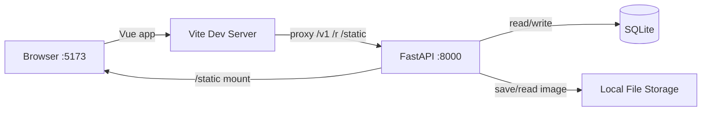
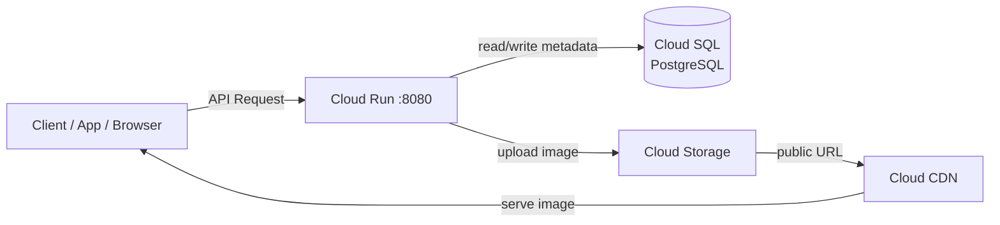

# QR Code Generator

A full-stack QR code management service. Vue 3 frontend + FastAPI backend, with dynamic redirect links, click tracking, and customisable QR images. Designed for local development with SQLite and production deployment on Google Cloud (Cloud Run + Cloud SQL + Cloud Storage + CDN).

## Tech Stack

**Backend**
- **Framework**: FastAPI + Uvicorn
- **ORM**: SQLAlchemy 2.0
- **Validation**: Pydantic v2
- **QR Generation**: qrcode + Pillow
- **Database**: SQLite (local) / Cloud SQL PostgreSQL (production)
- **Storage**: Local filesystem (local) / Google Cloud Storage (production)
- **Deployment**: Docker + Cloud Run

**Frontend**
- **Framework**: Vue 3 + TypeScript
- **Build tool**: Vite

## Architecture

### Local Development



### Production (GCP)



The `ENVIRONMENT` setting (`local` / `production`) switches database, storage backend, and image URL strategy via a factory pattern.

## API Endpoints

| Method | Path | Description | Status |
|--------|------|-------------|--------|
| `POST` | `/v1/qr_code` | Create a new QR code | 201 |
| `GET` | `/v1/qr_codes` | List all QR codes | 200 |
| `GET` | `/v1/qr_code/{token}` | Get QR code metadata | 200 / 410 |
| `PUT` | `/v1/qr_code/{token}` | Update target URL | 204 |
| `DELETE` | `/v1/qr_code/{token}` | Soft delete QR code | 204 |
| `GET` | `/v1/qr_code_image/{token}` | Generate/fetch QR image | 200 |
| `GET` | `/r/{token}` | 302 redirect to target URL | 302 |

`GET /v1/qr_code/{token}` returns **410** (not 404) for soft-deleted records.

### Image Query Parameters

| Param | Default | Range |
|-------|---------|-------|
| `dimension` | 256 | 32–2048 |
| `color` | `#000000` | 6-digit hex |
| `border` | 4 | 0–20 |

## Quick Start

```bash
# Backend
python3 -m venv .venv && source .venv/bin/activate
pip install -r requirements.txt
cp .env.example .env
uvicorn app.main:app --reload --port 8000

# Frontend (separate terminal)
cd frontend && npm install && npm run dev
# Open http://localhost:5173
```

Or use the API directly:

```bash
curl -X POST http://localhost:8000/v1/qr_code \
  -H "Content-Type: application/json" \
  -d '{"url": "https://example.com"}'
# → {"qr_token": "aBcDeFgHiJ"}

curl "http://localhost:8000/v1/qr_code_image/aBcDeFgHiJ?dimension=256"
# → {"image_location": "http://localhost:8000/static/qr/aBcDeFgHiJ/xxxxx.png"}

curl -L http://localhost:8000/r/aBcDeFgHiJ
# → 302 → https://example.com
```

## Testing

```bash
pytest tests/ -v
```

Uses FastAPI `TestClient` with an isolated test database — no side effects on development data.

## Production Deployment (GCP)

Prerequisites: [gcloud CLI](https://cloud.google.com/sdk/docs/install) installed, GCP account with billing enabled.

### 1. Setup Project & Enable APIs

```bash
gcloud projects create <PROJECT_ID>
gcloud config set project <PROJECT_ID>
gcloud services enable \
  run.googleapis.com \
  sqladmin.googleapis.com \
  storage.googleapis.com \
  cloudbuild.googleapis.com \
  artifactregistry.googleapis.com
```

### 2. Create Cloud SQL (PostgreSQL)

```bash
gcloud sql instances create qr-db \
  --database-version=POSTGRES_15 \
  --tier=db-f1-micro \
  --region=asia-east1

gcloud sql databases create qrdb --instance=qr-db
gcloud sql users set-password postgres --instance=qr-db --password=<DB_PASSWORD>
```

### 3. Create Cloud Storage Bucket

```bash
gcloud storage buckets create gs://<BUCKET_NAME> \
  --location=asia-east1 \
  --uniform-bucket-level-access

gcloud storage buckets add-iam-policy-binding gs://<BUCKET_NAME> \
  --member=allUsers \
  --role=roles/storage.objectViewer
```

### 4. Create Artifact Registry & Build Image

```bash
gcloud artifacts repositories create qr-repo \
  --repository-format=docker \
  --location=asia-east1

gcloud builds submit \
  --tag asia-east1-docker.pkg.dev/<PROJECT_ID>/qr-repo/qr-code-generator
```

### 5. Deploy to Cloud Run

```bash
gcloud run deploy qr-code-generator \
  --image asia-east1-docker.pkg.dev/<PROJECT_ID>/qr-repo/qr-code-generator \
  --region asia-east1 \
  --platform managed \
  --allow-unauthenticated \
  --add-cloudsql-instances <PROJECT_ID>:asia-east1:qr-db \
  --set-env-vars "ENVIRONMENT=production" \
  --set-env-vars "DATABASE_URL=postgresql+psycopg2://postgres:<DB_PASSWORD>@/qrdb?host=/cloudsql/<PROJECT_ID>:asia-east1:qr-db" \
  --set-env-vars "GCS_BUCKET=<BUCKET_NAME>" \
  --set-env-vars "CDN_BASE_URL=https://storage.googleapis.com/<BUCKET_NAME>" \
  --set-env-vars "BASE_URL=https://<CLOUD_RUN_URL>" \
  --set-env-vars "SERVER_SECRET=$(openssl rand -hex 32)"
```

### 6. Verify

```bash
curl -X POST https://<CLOUD_RUN_URL>/v1/qr_code \
  -H "Content-Type: application/json" \
  -d '{"url": "https://example.com"}'
```

### Cleanup (avoid ongoing charges)

```bash
gcloud sql instances delete qr-db --quiet
gcloud run services delete qr-code-generator --region asia-east1 --quiet
gcloud storage rm -r gs://<BUCKET_NAME>
gcloud artifacts repositories delete qr-repo --location=asia-east1 --quiet
```

See `.env.prod` for the full list of production environment variables.

## Key Design Decisions

- **Soft delete** — Records are never physically removed; `status` field filters active entries
- **302 redirect** (not 301) — Allows URL updates to take effect immediately; each redirect atomically increments `click_count`
- **Spec hashing** — QR images are cached by `SHA-256(image_spec)`, avoiding regeneration for identical parameters
- **Token generation** — `SHA-256(url + nonce + secret)` → Base62, first 10 chars. Retries on collision.
- **Pluggable storage** — `StorageBackend` ABC with factory pattern; swap backends without touching business logic
