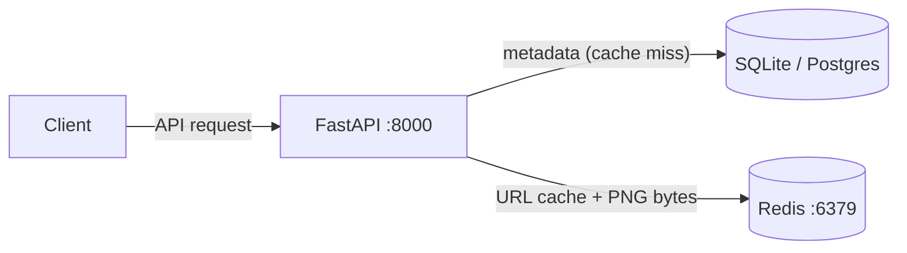

# QR Code Generator — 高 QPS 下的架構演進與壓測

一個 URL-shortener / QR-image 服務（FastAPI + Redis + Postgres）。重點是回答一個具體問題：

> **在高 QPS 下，redirect 路徑的 click 計數要怎麼設計，承載上限差多少？**

用 [k6](https://k6.io/) 在被測服務外部打到飽和，量三個 click-counting 架構的 RPS / p50 / p95 / p99。完整數據：[`docs/perf-report.md`](docs/perf-report.md)。架構圖與設計理由：[`docs/architecture.md`](docs/architecture.md)。

## 三個架構與壓測結果

| 版本 | redirect handler | click 計數 |
| --- | --- | --- |
| **A. 同步點擊** | sync `def`（threadpool）| redirect 內直接 `HINCRBY` Redis |
| **B. 異步 worker** | `async def`（event loop）| redirect 只 `XADD`，獨立 worker process 消費 |
| **C. 無 click** | `async def`（event loop）| 完全移除（[ADR-0003](docs/decisions/0003-remove-click-counting-mvp.md)）|

相同硬體 / k6 腳本 / DB / logging（structlog-only），只換 `api` container：

| Scenario | A. 同步點擊 | B. 異步 worker | C. 無 click |
| --- | --- | --- | --- |
| **redirect_hot RPS** | 1,620 | **2,227** (+37%) | **2,603** (+61%) |
| redirect_hot p99 | 329 ms | **234 ms** (−29%) | **190 ms** (−42%) |
| **redirect_cold RPS** | 1,121 | 1,301 (+16%) | 1,416 (+26%) |
| redirect_cold p99 | 202 ms | 152 ms | 77 ms (−62%) |
| **image_mixed RPS** | 458 | 486 | 458 |
| error rate | 0% | 0% | 0% |

- **異步 worker 拆分讓 hot path 承載 +37 %、p99 −29 %**——redirect handler 從同步等 `HINCRBY` 變成 fire-and-forget `XADD`，計數丟給獨立可水平擴展的 worker。
- 完全移除 click 計數再 +17 %（少一個 Redis op）。
- image 三架構持平——瓶頸是 CPU-bound PNG 生成，與 click 架構無關。

瓶頸定位（hot：uvicorn event loop / cold：DB connection pool / image：CPU-bound PNG），以及「要數萬 RPS 是架構問題（CDN offload + 水平擴展）不是 tuning」的分析，見 [`docs/perf-report.md`](docs/perf-report.md) 與 [`docs/architecture.md`](docs/architecture.md)。

## Tech Stack

- **Framework**: FastAPI + Uvicorn（single process，no `--workers`）
- **ORM / Migrations**: SQLAlchemy 2.0 + Alembic
- **Validation**: Pydantic v2
- **QR**: qrcode + Pillow
- **Database**: SQLite（local）/ PostgreSQL（Docker Compose / 壓測）
- **Cache**: Redis — URL cache + PNG byte cache
- **Logging**: structlog（JSON to stdout，見 [ADR-0004](docs/decisions/0004-simplify-observability-keep-structlog.md)）
- **Load testing**: k6（`scripts/k6/`）



## API Endpoints

| Method | Path | Description | Status |
|--------|------|-------------|--------|
| `POST` | `/v1/qr_code` | Create QR code（pre-warms URL cache） | 201 |
| `GET` | `/v1/qr_codes` | List all QR codes | 200 |
| `GET` | `/v1/qr_code/{token}` | Get metadata | 200 / 410 |
| `PUT` | `/v1/qr_code/{token}` | Update target URL（invalidates cache） | 204 |
| `DELETE` | `/v1/qr_code/{token}` | Soft delete | 204 |
| `GET` | `/v1/qr_code_image/{token}` | PNG bytes（`image/png`） | 200 / 404 |
| `GET` | `/r/{token}` | 302 redirect | 302 / 404 / 410 |

Image query params：`dimension`（32–2048，預設 256）、`color`（6-digit hex，預設 `#000000`）、`border`（0–20，預設 4）。

## Quick Start

```bash
# 最簡：SQLite + Redis
docker run -d -p 6379:6379 --name qr-redis redis:7-alpine
python3 -m venv .venv && source .venv/bin/activate
pip install -r requirements.txt
cp .env.example .env
uvicorn app.main:app --reload --port 8000   # SQLite 自動建表

curl -s -X POST http://localhost:8000/v1/qr_code \
  -H "Content-Type: application/json" -d '{"url": "https://example.com"}'
# → {"qr_token": "aBcDeFgHiJ"}
curl -s -o /dev/null -w "%{http_code} → %{redirect_url}\n" \
  http://localhost:8000/r/aBcDeFgHiJ
# → 302 → https://example.com
```

### Docker Compose（Postgres，重現壓測環境）

```bash
docker compose up -d
docker compose exec api alembic upgrade head    # Postgres schema 一次性，必跑
docker compose logs api | jq .                  # 結構化 JSON log
```

stack 只有 `api + postgres + redis`。PostgreSQL 不會自動建表，**必須**先 `alembic upgrade head`。重現壓測數字的完整步驟見 [`docs/perf-report.md`](docs/perf-report.md) §How to reproduce 與 [`scripts/k6/README.md`](scripts/k6/README.md)。

## Testing

```bash
pytest tests/ -v    # FastAPI TestClient + isolated SQLite + fakeredis；無需外部資源
```

Schema 管理：SQLite 走 startup `create_all`；PostgreSQL 走 `alembic upgrade head`（migration 在 `alembic/versions/`，autogenerate 用 `alembic revision --autogenerate -m "..."`）。pytest 用 transient SQLite，不需 migration。

## Key Design Decisions

- **Soft delete** — 不物理刪除，所有查詢 filter `status == 'active'`
- **302 redirect** — 讓 URL 更新立即生效
- **Click counting 移除（[ADR-0003](docs/decisions/0003-remove-click-counting-mvp.md)）** — 收斂 MVP 在 redirect 路徑；背後是讀寫職責分離（CQRS-style）的設計判斷，analytics tier 推薦走 Cloud CDN logs → Pub/Sub → BigQuery（未實作、未壓測）
- **觀測性簡化（[ADR-0004](docs/decisions/0004-simplify-observability-keep-structlog.md)）** — 只留 structlog；single-process 服務不值得自架 tracing/metrics stack 的 overhead
- **URL cache pre-warm** — `POST` 時寫 `qr:url:{token}`（TTL 24h），首次 redirect 即 cache hit；update/delete 失效
- **Image cache** — PNG bytes 存 Redis，content-addressed key `qr:img:{spec_hash}:{url_hash16}`，TTL 7 天；cache miss 在 process 內重生（~10–20ms CPU），無 GCS / CDN / disk
- **Token generation** — `SHA-256(url + random_nonce + SERVER_SECRET)` → 前 10 Base62 字元，UNIQUE 衝突重試 5 次

更深的架構與理由見 [CLAUDE.md](CLAUDE.md) 與 [`docs/decisions/`](docs/decisions/)。
